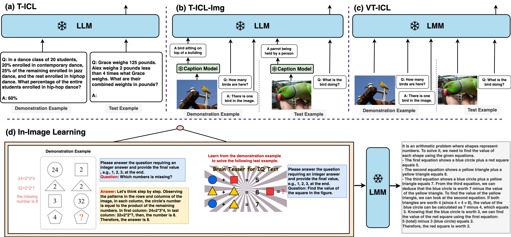

# IIL


# Requirement
```shell
pip install -r requirements.txt
```

# Download Dataset
The processed dataset and demonstration examples are available from this [link](https://drive.google.com/file/d/1eL3BnWPMLJxm3iAptX_QQRuijW9dl9AM/view?usp=sharing).
Unzip the file after downloading and keep the ```dataset``` directory in the root directory of the project.
```text
----IIL
    |----dataset
    |----src
    ...
```
# Run In-Image Learning and Baselines
## In-Image Learning
```shell
python run_iil.py --exp_name exp_on_mv --dataset mathvista --lt few_shot
```

## Visual-text interleaved in-context learning
```shell
python run_vticl.py --exp_name exp_on_mv --dataset mathvista --lt few_shot
```

## Text-only in-context learning
```shell
python run_ticl.py --exp_name exp_on_mv --dataset mathvista --lt few_shot
```

# Cite
If you find **In-Image Learning** useful for your research and applications, please kindly cite using this BibTeX:
```latex

```
